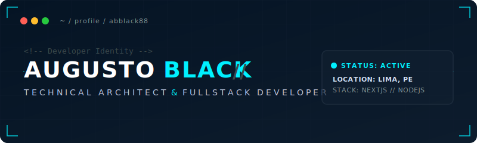

# Hi there 👋

  

  

 

### 💡 Arquitectura y Desarrollo de Ecosistemas Digitales Escalables

Soy un **Arquitecto Técnico y Desarrollador Fullstack** con un enfoque implacable en la precisión técnica, el rendimiento optimizado y la estética minimalista. Me especializo en diseñar servicios backend distribuidos, modularizar arquitecturas de frontend y configurar pipelines automatizados de infraestructura en la nube.

*   🔭 **Áreas de Enfoque**: Arquitectura de Microservicios, Sistemas Escalables, Optimización de Bases de Datos y Patrones de Diseño Modernos.
*   🎯 **Filosofía**: Código limpio e intuitivo, APIs autocontenidas y cero desperdicio de recursos del sistema.

---

### ⚡ Arsenal Tecnológico

Para mantener la consistencia estética con la identidad visual **Fusión Dark Minimal**, las herramientas están clasificadas por capas técnicas y presentadas con colores uniformes:

<table>
  <tr>
    <td valign="top" width="33%">
      <h4>💻 Frontend &amp; WebGL</h4>
      
      
      
      
      
    </td>
    <td valign="top" width="33%">
      <h4>⚙️ Backend &amp; Datos</h4>
      
      
      
      
      
    </td>
    <td valign="top" width="33%">
      <h4>☁️ DevOps &amp; Infra</h4>
      
      
      
      
      
    </td>
  </tr>
</table>

---

### 🎓 Certificaciones &amp; Formación

> **Conquer Blocks | Master en Desarrollo Web Full Stack**  
> *Identificador de Credencial:* `CB-7729-BLK`  
> *Estado:* `94% Completado (Prework: Completado)`  
> *Competencias:* Arquitecturas Fullstack modernas, Bases de Datos Relacionales/NoRelacionales, metodologías ágiles de ingeniería y diseño de UI/UX premium.

---

### 📂 Repositorios Activos (Featured Projects)

<table width="100%">
  <tr>
    <td width="50%" valign="top" style="background: rgba(18, 33, 49, 0.4); border: 1px solid rgba(255, 255, 255, 0.08); border-radius: 8px; padding: 16px;">
      <h4>⚙️ Mi Primer Repo</h4>
      
La base inicial de mi carrera de desarrollo. Un repositorio robusto enfocado en principios de diseño de interfaces web, algoritmos centrales y experimentación con lógica nativa en JavaScript.

      <code>HTML5</code> <code>CSS3</code> <code>JS_Core</code>
        
      <a href="https://github.com/ABblack88/mi-primer-repo"><b>Ver Repositorio →</b></a>
    </td>
    <td width="50%" valign="top" style="background: rgba(18, 33, 49, 0.4); border: 1px solid rgba(255, 255, 255, 0.08); border-radius: 8px; padding: 16px;">
      <h4>⚛️ Proyecto 1 Copia</h4>
      
Una iteración arquitectónica centrada en la modularidad y escalabilidad de componentes. Diseñado utilizando patrones reactivos y renderizado optimizado de alta velocidad.

      <code>React</code> <code>Node.js</code> <code>Vite</code>
        
      <a href="https://github.com/ABblack88/proyecto-1-copia"><b>Ver Repositorio →</b></a>
    </td>
  </tr>
</table>

---

### 📈 Métricas de Desarrollo

<table width="100%">
  <tr>
    <td width="50%" align="center" style="border: none;">
      
    </td>
    <td width="50%" align="center" style="border: none;">
      
    </td>
  </tr>
</table>

---

### ✉️ Contacto &amp; Redes (Initiate Protocol)

¿Interesado en colaborar en arquitecturas de software de alta exigencia o proyectos full stack? Iniciemos una conversación.

  
  
  

